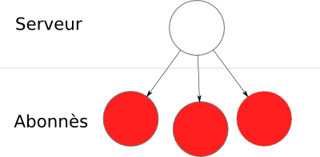

!SLIDE
# XMPP #

!SLIDE bullets incremental
# Pour vous XMPP c'est : #

* Gmail
* Liste d'amis (roster)
* Envoi de message

<!--
* Jabber
* Très utilisé
* Cisco
* Gmail
-->

!SLIDE bullets incremental
# Extensible messaging and Presence protocol #

* Protocole de communication basé sur XML
* Orienté présence
* Extensible

!SLIDE
# Standards #

<!--* RFC
* SASL
* StartTLS/TLS
* GPG
* Extensions (XEP)
-->

!SLIDE bullets
# Connexions #

* Server to server (s2s)
* Server to client (c2s)

!SLIDE bullets
# JID #

* juliet@capulet.lit
* juliet@capulet.lit/af83

!SLIDE
# Streams  #

    <stream>
    ...
    </stream>

!SLIDE bullets incremental
# Stanzas #

* message
* presence
* iq

!SLIDE code smaller
# Message #

    <message from="juliet@capulet.lit" to="romeo@montague.lit">
        <body>Hello World !</body>
    </message>

!SLIDE code smaller
# Presence #

    <presence from="juliet@capulet.lit" to="romeo@montague.lit">
        <show>away</show>
        <status>@af83</status>
    </presence>

!SLIDE code smaller
# IQ #

    <iq from="juliet@capulet.lit" to="romeo@montague.lit" type="get">
        <query xmlns='http://jabber.org/protocol/disco#info'/>
    </iq>

!SLIDE code smaller

    <iq from="juliet@capulet.lit" to="romeo@montague.lit" type="result">
        <query xmlns='http://jabber.org/protocol/disco#info'>
            <identity category='client' type='bot'/>
        </query>
    </iq>

!SLIDE code smaller

    <iq from="juliet@capulet.lit" to="romeo@montague.lit" type="set">
        <pubsub xmlns='http://jabber.org/protocol/pubsub'>
            <subscribe node='princely_musings'
                       jid='francisco@denmark.lit'/>
         </pubsub>
    </iq>

!SLIDE
# Extensions ? #

!SLIDE
# Disco #

!SLIDE
# Multi-User Chatrooms  #

!SLIDE center
# Publish-Subscribe/PEP #

!SLIDE
# Ad-hoc command #

!SLIDE
# XHTML-IM #

!SLIDE
# Jingle

!SLIDE bullets incremental
# Transport #
* Sockets bidirectionel
* HTTP via comet (BOSH)
* WebSocket ?

!SLIDE bullets incremental
# Lien #

* http://xmpp.org/

!SLIDE
# Questions #
